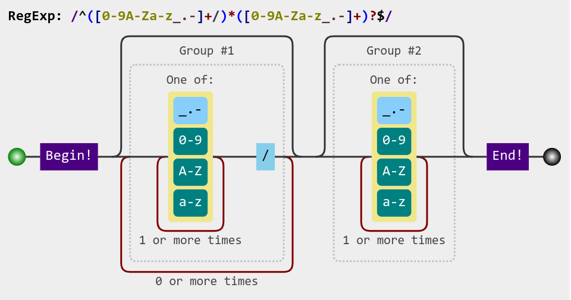

### 基本框架

- `(cen)tra`
  - 中心化的服务器，用于启动不同线程上面的replica同步服务
  - 控制流的传输
  - 测试命令的传输：所有的修改和同步操作由`centra`来统一发送给不同的`reptra`
- `(rep)tra`
  - 接受同步的命令
  - 使用RPC完成fetch patch的操作
- [ ] 支持不同的`reptra`直接使用命令行来同步

### Supported Local Modification

基本假设：在文件创建到相应的`inotify::wathcer`创建之前，创建的文件或者文件夹里面的内容不会被修改。

即代码足够快，文件修改足够慢或间隔足够长。

- [x] CREATE
- [x] DELETE
- [x] MODIFY
- [ ] MOVED_TO
- [ ] MOVED_FROM

Possible Solution

- 文件被移动了那么不同副本的同步语义上肯定就是被删掉/创建了，因为不同副本的对应关系是按照path来对应的。
- MOVED_FROM直接按照DELETE来处理，需要递归删除所有的node
- MOVED_TO当作创建

Other Problems

- [ ] folder从别的地方移动过来，可能直接整个文件夹移动过来（也就是没有`-r`的`mv`，只是将directory的inode移动，实际上就是所有sub files全部同时移动），没有办法进行监测，所以需要主动再次扫描文件夹
- [ ] folder的删除如果整个移动走了，可能需要把inotify里面的watch给unregister掉

### Reptra Emulation

- 采用不同的线程
- 本地随即分配可用端口，然后将端口发送给`centra`，`centra`用不同的端口来区分不同的`reptra`

###  Rsync Algorithm
- Rust 的 `fast_rsync` 库
- 一次RPC
  - A : send signature
  - B : diff with the data, send the patch back
  - A : receive the patch, apply the patch

### Test

- 外部的 script 不断修改不同 replica 的文件
- replica 的同步请求由 centra 来统一发送，便于测试

### Working Mode

- 所有的同步都以 `fetch_delta` 为基本模式
- `request_sync(A, B)` 可以表示为向`A`发送`fetch_delta(B)`的请求，也就是`B -> A`的同步
- `request_sync`可以由centra来发送，在没有centra的时候，也可以在replica之间独立完成

### Replica 端 RPC

- 接受来自中心服务器的同步请求`request_sync`
- 接受来自其他replica的同步`fetch_delta`

### Timestamp

通过watching的方式来更新

- 利用 `inotify` 来定义一次文件修改/创建/删除的 atomic 操作
- 对于每一个 atomic 操作， local 的 timestamp 都会 ++

通过scanning的方式来更新

- ~~本地的修改全部算成一次，只有同步的时候会让 local time ++~~
- ~~利用linux系统本地的file metadata来获取时间戳，或者采用哈希比较~~

### 并发带来的同步问题

3 Levels of Update

- local file system，本地的用户可以直接修改的文件系统
- modification time，本地的修改之后会更新的时间戳
- synchronization time，在有了rpc同步请求之后会更新的时间戳

Modification Time Update

- 严格按照`inotify`的顺序来更新，前一个执行完才会执行后一个
- 或者在sync之前的更新顺序都是无关紧要，在sync之前可以全部并发执行
- 如果并发执行，那么需要对更新过程中会修改的节点上锁，使用`tokio::sync::RwLock`

Synchronization Time Update

- 同步和本地修改的冲突requirement
  - 同步中的文件需要避免local file system的修改的发生
  - 同步中的文件也需要避免本地的modification time的更新
- 即同步的时候，需要保证local file system和modification的metadata都是处于frozen的状态
  - 给需要同步的整个filetree的根目录加上进程锁，只有tra进程可以修改（本地的修改会更新每一级目录的modificatin time，所以需要从filetree的根目录来上锁）
  - 上了process lock之后还需要等待`inotify`的处理队列处理完成（之前的修改），然后进入同步模式
- sync操作的并发问题
  - 一个filetree进入sync模式之后，其他的sync请求需要等待
  - sync的时候应该同样对整个filetree加锁（不要被mod或者其他的sync修改）
  - `sync A -> B`：A的filetree是read，B的filetree是write。使用`fcontl`来实现对文件的读写上锁
  - 全部上锁完毕进入sync模式

### Tools

- 文件夹遍历：`walkdir`
- Rsync 算法：`fast_rsync`
- 异步框架：`tokio`, `futures`
- gRPC：`tonic`, `prost`, `tonic-build`
- 正则匹配：`regex`
- 文件监测：`inotify`

