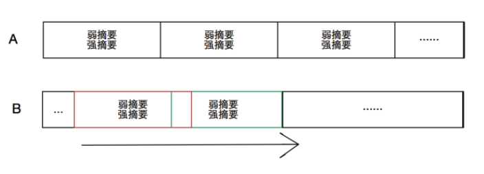

### Socket

- 使用 `socket` 模块实现 IPC 通信。
- Aborted

### RPC

- ~~去你的socket通信~~，直接nake bytes stream太难写了，一堆调用，还要自己写解析器
- rust RPC 支持,`tonic` crate
- 使用 `.proto3` 文件来定义 remote procedure call 的接口

#### 两种不同的网络编程模型

- `std::net` 同步阻塞的网络
- `tokio::net` 异步非阻塞的网络

#### Reptra 创建服务端

- RPC 每个replica所在的服务器都需要有相互的RPC调用，所以每个replica都需要创建一个服务端

检测port是否可用:
- rand 一个 port number
- 用`std::net::TcpListener`来尝试连接
- 连接成功，转化为`tokio::net::TcpListener`
- 用`tokio::TcpIncoming`来把`TcpListener`转化为`TcpStream`
- 使用`tonic::transport::Server::builder`中的`serve_incoming()`来从已有的流建立服务端

服务端采用异步任务

- 每一个replica仅仅显式开一个`thread`，其余的并发用async来实现
- 对于已有的Future server, 如果直接await, 会一直阻塞在这里，从而这个控制流不可用
- 使用`tokio::spawn`来创建一个异步任务，这个任务会在后台运行，不会阻塞当前的控制流
- >The provided future will start running in the background immediately when spawn is called, even if you don’t await the returned JoinHandle.（会立马执行，即使没有对JoinHandle进行await）
- > It is guaranteed that spawn will not synchronously poll the task being spawned. This means that calling spawn while holding a lock does not pose a risk of deadlocking with the spawned task.（不会同步地轮询被spawn的任务，所以不会死锁）
- > There is no guarantee that a spawned task will execute to completion. When a runtime is shutdown, all outstanding tasks are dropped, regardless of the lifecycle of that task. （可能不会执行完）
- > This function must be called from the context of a Tokio runtime. Tasks running on the Tokio runtime are always inside its context, but you can also enter the context using the Runtime::enter method.（必须在Tokio runtime的上下文中调用，或者可以用`Runtime::enter`来进入上下文）

### rsync 增量传输算法

- A 按照固定长度划分
- B 滑动窗口，不断地check
- 通过弱摘要和强摘要双重校验，来判断是否相同。弱摘要可以用于快速判断。

### `fast_rsync` in Rust

- 先确定签名的参数，block的大小和MD4 哈希的大小
- 用`Signature::calculate`计算Hash
- 转换成`IndexedSignature`，用于比较
- `diff`用来计算Delta
- `apply`用来打补丁

### Rust 异步编程

#### `async` 函数(block)和 `await` 的语义

- 编译器生成状态机，用于异步执行不同的任务
- Rust 的 runtime 会管理不同异步任务的执行：`futures`,`tokio`,`async-std` 都是 runtime 库
- 一个`async`函数会返回一个`Future`对象，并不会立即执行
- `await` 相当于等待这个 future 对象执行完毕，所以会暂时挂起当前的任务
- `await` 的地方才会切换控制权

#### `poll`, `wake`, `executor`, `future`

轮询 poll 

- 异步任务的执行是通过轮询来驱动的
- 一个 future 在这次轮询可以做完，就返回 `Poll::Ready`，否则返回 `Poll::Pending`
- 没有做完的时候会返回注册一个`Waker` (用于回调当前的这个函数，但是可能是其他的函数来调用)，当需要等待的某个任务做完的时候，会调用`wake` 方法来将这个函数放入 poll 的队列中。（也就是先 wake, wake 再轮询）

Waker && wake

- 唤醒器通过一些 Arc 的 clone 来实现和任务的绑定
- Waker 是绑定 task 的。

调度器

- 由异步任务的运行时库来实现
- 调度器首先负责对顶层的 future 进行 poll (轮询)
- Future 做完之后，会调用 wake 加入新的 future 到队列中，继续 poll ，直到所有的 future 都完成。
- `futures::executor::block_on()`是一个简单的 executor ，在同步函数里面调用异步函数，并且会阻塞。
- `#[tokio::main]` 可以标记一个异步函数为主函数， tokio 会创建一个 runtime 来执行这个函数。
- 可以把`block_on`调用的异步任务看成是一组异步任务的入口，里面有一些`await`语句可以用于规定执行的相对顺序。

Context 上下文

- `std::task::Context` 有一个 `Waker` ， 并且储存了这个异步任务的最新的执行状态
- 简单理解就是一个异步任务的上下文，方便每次 poll 的时候接着上次的状态继续
- 一些变量的值，时间戳都是在这里面储存的

Waker 的上下文

- 这个`Waker` 是之前的 `Context` 里面的 `Waker`，它的上下文和`Context`的上下文不一样
- 这个上下文表示 Task Context，一个 Future 有时候会切换执行环境，例如 move 到另一个线程， 这个时候操作系统调度的任务上下文会发生改变，所以**每次轮询的时候需要更新waker (inside the `Context` struct)，而不是只是调用 Context::waker()**

### Rust 闭包

#### `Fn`, `FnMut`, `FnOnce`

- `Fn(&self)` 对环境中的变量不可变引用
- `FnMut(&mut self)` 对环境中的变量可变引用
- `FnOnce(self)` 对环境中的变量所有权进行转移

#### Closure

- 一个 closure 是一个匿名函数，可以捕获环境中的变量，并且根据捕获的方式，自动地实现上面三个 trait (some may not)
- 所有的 closure 都实现了 `FnOnce`。如果只实现了 `FnOnce`，那么这个 closure 只能被调用一次。