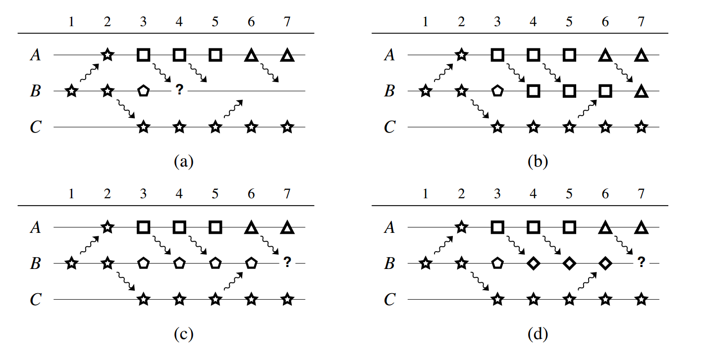
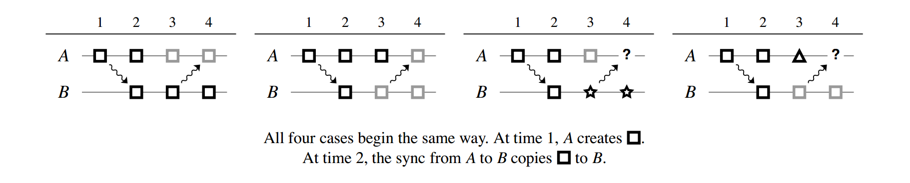
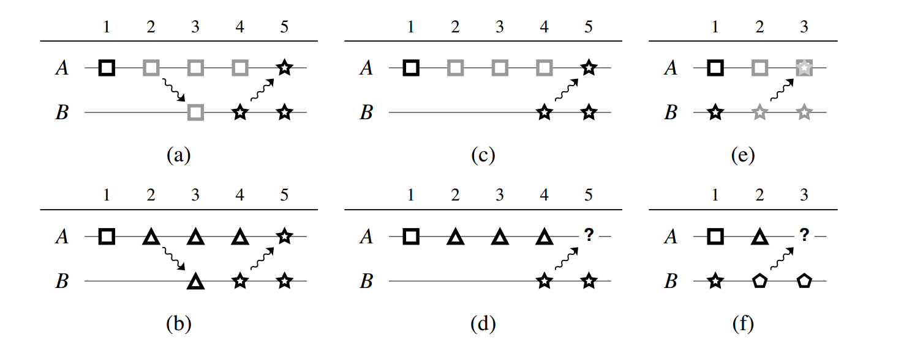
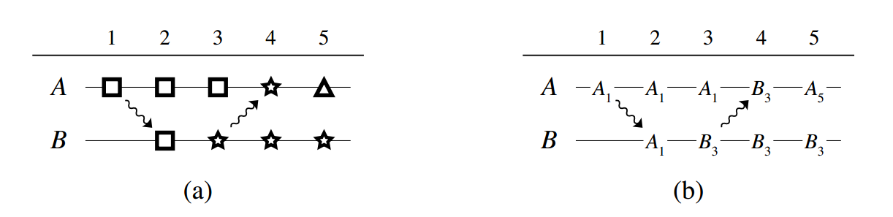
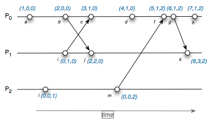

### Abstraction

- 一个记录修改的历史
- 一个记录同步的历史

### Principle

- No lost update
- Two files are considered independent if and only if neither is a prefix of the other

### Goals

1. 没有同步模式的要求：任意两台计算机不需要借助第三台计算机来同步
2. 检测到所有的冲突，并且没有 false positive
3. 对于删除的文件，不需要花费空间记录之前删掉的东西
4. 两台设备比较文件差异的时候，带宽的使用量和不同文件的大小成正比
5. 支持文件系统子树的部分同步

### Global Clock Issue

- 没有必要 share 一个 common cock
- 所有的同步都是基于过去的修改历史记录 

### Conflicts Handling



- 在4时刻遇到了问题，手动解决问题
- (b)的情况，由于`三角形`是`正方形`的后继，可以同步
- (c)的情况，`五边形`维持了原状，**`正方形`也一直没有同步上来**，所以`三角形`和`五边形`是冲突的
- (d)的情况，`菱形`和`三角形`依然冲突。
- 有冲突，人为合并之后会记录冲突的 solution, 相同的请求再次发送的时候，不会反复 report

### Synchronizing Creations and Deletions



- (a) 没有 op
- (b) 删掉是最新的操作，没有 lose update
- (c) 删掉和修改是不同的分支， report a conflict
- (d) 同上

这里将 deletion treat like 一种修改，但是会有一些小问题



- (a) $\rightarrow$ (b) 没有啥问题
- (c) $\rightarrow$ (d) 我们应该总是可以 propagate 到已经被删掉的文件
- (e) $\rightarrow$ (f) deleted 到 deleted 不应该有冲突

解决的 insight

- 一个被删除的文件不应该和任何一个独立创建的文件冲突（没有公共的父节点）
- 即使被删除的文件和需要同步的文件是独立发生的，但是可以强行拟定顺序： **the deleted file version is treated as happening before the other version was created**.

### Synchronizing File Trees

Brute Force Method

- 文件夹的每一个层次结构全部都同步一遍
- 浪费带宽，所以需要支持只对修改的部分进行数据的传输

Vector time pairs 需要支持 partial synchronization

### Algorithm Details

Basic version vectors





- 如果向量是一样的，那么历史也是一样的
- 如果严格小于，则一个是另一个的前缀
- 否则，不满足严格的偏序关系：独立

Vector Time Pairs

- Modification Time : 
  - Which version we have.
  - **Some kind of solid information about the past**.
- Synchronization Time : 
  - How much we know.
  - **Contains some propagation information**.

$m_A \leq m_B \iff m_A \leq s_B$

- $\implies$ ： 有$m_B \leq s_B$ 成立
- $\impliedby$ : $B$的所有修改都在$m_B$之前，也就是**修改和同步之间没有任何的事情发生**，如果$A$的修改小于等于$B$的同步，那么$A$的修改一定在$B$的修改之前。
- $m_A \leq s_B$ 的比较：一个副本知道什么 V.S. 另外一个副本有些什么

### 冲突的记录

三种方案

- 直接覆盖过去
- 保持不动，不做操作
- 创建新的文件来整合两个版本


Modification Time 

- (b) : $(A_3, B_1)$
- (c) : $(A_0, B_3)$
- (d) : $(A_0, B_4)$

Sync Time

- All solution's sync time : $(A_3, B_4)$

Advantage

- 由于是比较Sync时间，所以5和6的同步并不会有冲突。
- 可以发现 $m$ 和 $s$ 之间并不是真的没有任何操作。
- 在有冲突并且通过取舍的方式来解决之后，可以看成是丢弃了某一方的 modification ，这就是为什么用 sync time 和 modi time 比较可以记录冲突的解决过程。

### Synchronizing Deletions

- 对于每一个文件，记录一个 creation time ，用于看一个空文件和一个非空文件是否具有共同的 derive
- 对于删除的文件只需要记录一个 sync time 和一个 deletion notice, 可以节约空间

Details

```rust
// sync A -> B, B is empty
pub fn sync(file A, file B){
    if A.m <= B.s {
        // B is derived from A
        do_nothing();
    }
    else if !(A.c <= B.s){
        // they are created independently
        // notice that when the normal condition : A.s >= B.m are also satisfied here
        // as A can see B's modification, and B is empty, so A is created based on B
        copy_file(A, B); // copy A -> B
    }
    else{
        report_conflict(A, B);
    }
}

// sync B -> A, B is empty
pub fn sync(file A, file B){
    if A.m <= B.s {
        delete_file(A);
    }
    else if !(A.c <= B.s){
        // independent creation : do nothing
        do_nothing();
    }
    else{
        report_conflict(A, B);
    }
}
```