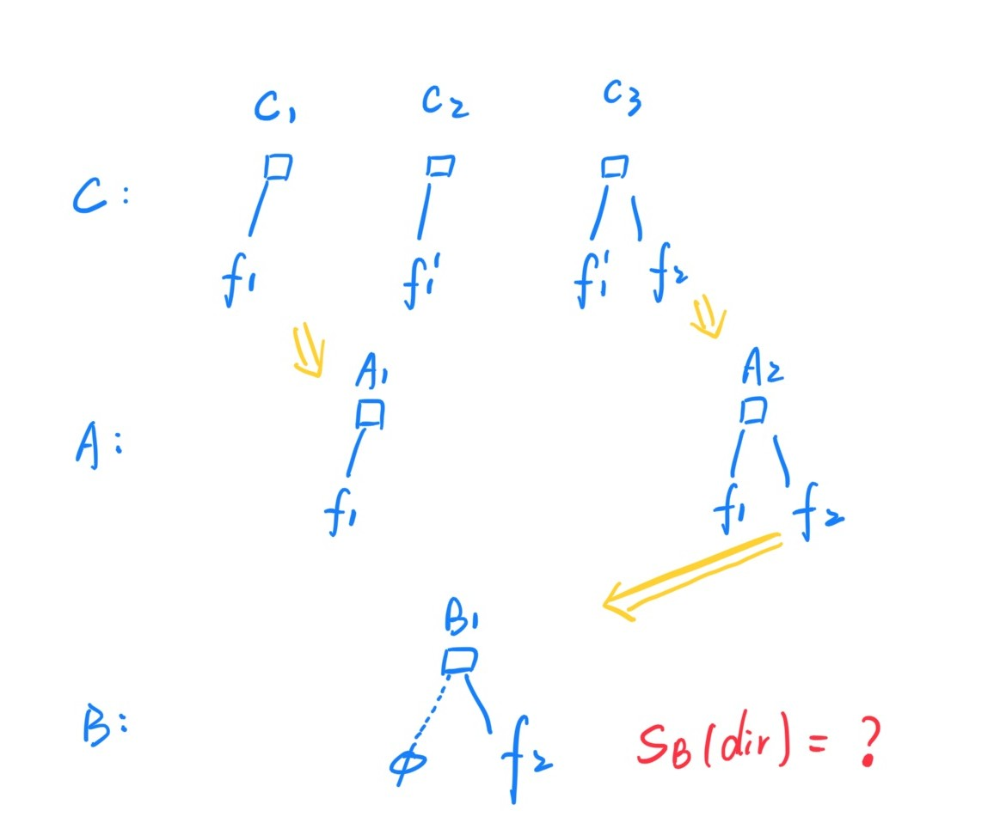

### Abstraction

- `mod time` : 一个记录修改的历史
- `sync time` : 一个记录同步的历史

### Principle

- No lost update
- Two files are considered independent if and only if neither is a prefix of the other

### Goals

1. 没有同步模式的要求：任意两台计算机不需要借助第三台计算机来同步
2. 检测到所有的冲突，并且没有 false positive
3. 对于删除的文件，不需要花费空间记录之前删掉的东西
4. 两台设备比较文件差异的时候，带宽的使用量和不同文件的大小成正比
5. 支持文件系统子树的部分同步

### Global Clock Issue

- 没有必要 share 一个 common cock
- 所有的同步都是基于过去的修改历史记录 
- 一个 replica share 一个 global event counter

### Conflicts Handling

- 在4时刻遇到了问题，手动解决问题
- (b)的情况，由于`三角形`是`正方形`的后继，可以同步
- (c)的情况，`五边形`维持了原状，**`正方形`也一直没有同步上来**，所以`三角形`和`五边形`是冲突的
- (d)的情况，`菱形`和`三角形`依然冲突。
- 有冲突，人为合并之后会记录冲突的 solution, 相同的请求再次发送的时候，不会反复 report

### Synchronizing Creations and Deletions

- (a) 没有 op
- (b) 删掉是最新的操作，没有 lose update
- (c) 删掉和修改是不同的分支， report a conflict
- (d) 同上

这里将 deletion treat like 一种修改，但是会有一些小问题

- (a) $\rightarrow$ (b) 没有啥问题
- (c) $\rightarrow$ (d) 我们应该总是可以 propagate 到已经被删掉的文件
- (e) $\rightarrow$ (f) deleted 到 deleted 不应该有冲突

解决的 insight

- 一个被删除的文件不应该和任何一个独立创建的文件冲突（没有公共的父节点）
- 即使被删除的文件和需要同步的文件是独立发生的，但是可以强行拟定顺序： **the deleted file version is treated as happening before the other version was created**.

### Conflicts Resolution

三种方案

- 直接覆盖过去
- 保持不动，不做操作
- 创建新的文件来整合两个版本

Modification Time 

- (b) : $(A_3, B_1)$
- (c) : $(A_0, B_3)$
- (d) : $(A_0, B_4)$

Sync Time

- All solution's sync time : $(A_3, B_4)$

Advantage

- 由于是比较Sync时间，所以5和6的同步并不会有冲突。
- 可以发现 $m$ 和 $s$ 之间并不是真的没有任何操作。
- 在有冲突并且通过取舍的方式来解决之后，可以看成是丢弃了某一方的 modification ，这就是为什么用 sync time 和 mod time 比较可以记录冲突的解决过程。

### Synchronizing Deletions

- 对于每一个文件，记录一个 creation time ，用于看一个空文件和一个非空文件是否具有共同的 derive
- 对于删除的文件只需要记录一个 sync time 和一个 deletion notice, 可以节约空间

### Synchronizing File Trees

- 对于文件夹，同样分配 sync time 和 modification time
- `Sync Time` : **element-wise minimum** sync time of its children
- `Modification Time` : **element-wise maximum** modification time of its children

### Algorithm Details

Vector Time Pairs

- Modification Time : 
  - Which version we have.
  - 做出修改的时间
  - the most recent reachable ancestor at which a modification occurred.
- Synchronization Time : 
  - How much we know.
  - 同步的时间，是这个 replica 的这个时间上的文件： record that we know about the file as it existed on A at time t.
  - the most recent reachable ancestor on that replica.

$m_A \leq m_B \iff m_A \leq s_B$

- $\implies$ ： 有$m_B \leq s_B$ 成立
- $\impliedby$ : $B$的所有修改都在$m_B$之前，也就是**修改和同步之间没有任何的事情发生**，如果$A$的修改小于等于$B$的同步，那么$A$的修改一定在$B$的修改之前。
- $m_A \leq s_B$ 的比较：一个副本知道什么 V.S. 另外一个副本有些什么

### Details Not Mentioned in the Paper

#### Event Counter
- 每次修改的时候, `m_A = ++counter_A`
- 每次同步的时候，`A -> B`, `s_b = ++counter_B`

#### Time Vectors' Update For Local Modification

- local的event，如果需要修改mod time, 那么也需要修改sync time（Sync time不会比mod time小）。

#### Time Vectors' Update For Sync Operation

- Mod time在同步的时候是直接覆盖过去，conflict resolution的时候也是这样。
- 同步的时候，sync time用的是当前的最新的时间，而不是这个file/dir的sync 时间（看上去没啥区别，但是这样可以让整个file tree里的东西共享一个sync time, 便于memory space的优化）。

#### Time Vectors' Update For File Tree

论文里面说sync time是element-wise minimum，mod time是element-wise maximum, 但是没有明确指出**仅更新自文件(夹)的时候，每一级的父文件夹向量更新的语义和具体算法**。

文件夹在skip的时候，是同样也是比较$m_A \leq s_B$，所以我们需要保证

- Replica A的这个文件夹子树里面的所有modification没有比$m_A$更大的。
- Replica B的这个文件夹子树里面的所有的文件都应该至少比$s_B$大。

其中，对于mod time, 不需要保证所有小于$m_A$的修改我们都要有，都要在文件夹里面。**也就是从文件夹的视角看，mod time并不代表我们有了某个时间之前的所有修改，不具有sequntial的性质，而是说我们已有的修改中的最大的时间**。

单文件的mod time是需要有上面这个语义的，**所有mod time之前的更新我们都有过**。所以单文件的mod time vector可以只用一个scalar(the latest modification)来表示。

对于sync time, 如果需要和mod time进行比较，那么语义应该是：**对于vector中的每一个replica位置，假设是A的sync time, 位置是replica B，value为13，那么B里面的所有文件在A里面的状态都应该至少是13**。

这就提出了一个问题：**因为子文件夹的部分更新，而导致父文件夹的sync time更新，由于文件夹的sync time是要考虑内部的所有文件，所以还需要考虑那些没有sync过来的子文件(夹)**。比如`A`的文件为`A1: dir/file1`和`A2: dir/file2`，B一开始为空，将`file2`同步过来，如何不考虑没有同步过来的`file1`，那么`B`中的`dir`的sync time会是`A2,B1`，但显然`B`是看不到`A1:file1`的状态的。

两种resolution

- 对于没有full sync的文件夹，不更新sync time，直接忽略，但是这样做不到strict bandwidth proportional to changed file size。用势能分析的方式可以得到平均的额外开销依然是线性。
- 对于partial sync的文件夹，比如`dir/file2`只同步了`file2`，但是对于`file1`没有同步过来的文件，不知道怎么处理sync time。

于是对于文件夹的同步算法的细节

- Mod time正常取max就好了，走完所有的父目录。
- Sync time的话
  - 只有在full synchronize的时候才更新dir的sync time
  - 走完所有的父目录取，如果当前父目录的所有第一级子目录都存在，那么就可以更新sync time

### Some Insights

这种对于global wall time完全忽略的文件同步器，关注*事件发生具有明显间隔，不会有因为global time不同带来的consistency问题，但是发生在不同副本*这个场景。

理论上来说，所有的修改都是看成sequntial的，一旦有分叉，那么分叉的两头再次尝试交互就会有conflict.

也就是原本sequential的操作，分布到了不同的机器上面，可以看成是将数列中的每一个点依次放到不同的队列中，同一个队列的先后顺序依然有保证。

### Lamport Timestamp

传统的Lamport时间戳，可以解决整个分布式synchronizer中只有一条线的情况，但是对于多条线的情况，没有办法判断。

### Vector Time

有分叉的场景，实际上是一棵树，根节点是initial，不同的叶子是head。

树的情况下，在没有出现conflict的时候，每个机器上的存储顺序依然是按照从根一直单调向下的顺序的。

由于依然是将节点分布在不同的机器上，所以对于每一个head，记录所有的机器上的最近的ancestor，就可以知道head所有的ancestor有哪些（前缀都是）。

不同head如果synchronize，必定会有conflicts，在vector time前提下，没有办法解决，一个不合法的同步多次冲突的问题：`A->B`有冲突，保留`A`（没有干任何事情），但是下次同步`A->B`时依然会有冲突。

### Vector Time Pairs

依然是有分叉的树形结构

- modification time表示修改的路径：从根节点到当前节点，所有的修改
- synchronizatin time表示这个副本acknowledge的路径：可能不是一个链状结构，因为有可能是解决了conflicts之后的合并。这些acknowledge的路径上包含了不同的heads, 这些heads被认为是和当前副本具有前驱关系的，被当前副本承认的。

什么时候需要更新sync time

- 文件没有创建的时候，sync time为0
- 文件修改的时候，sync time和mod time对应更新
- 文件被删掉之后，sync time为删除时候的时间
- 被其他副本propagate的时候，更新